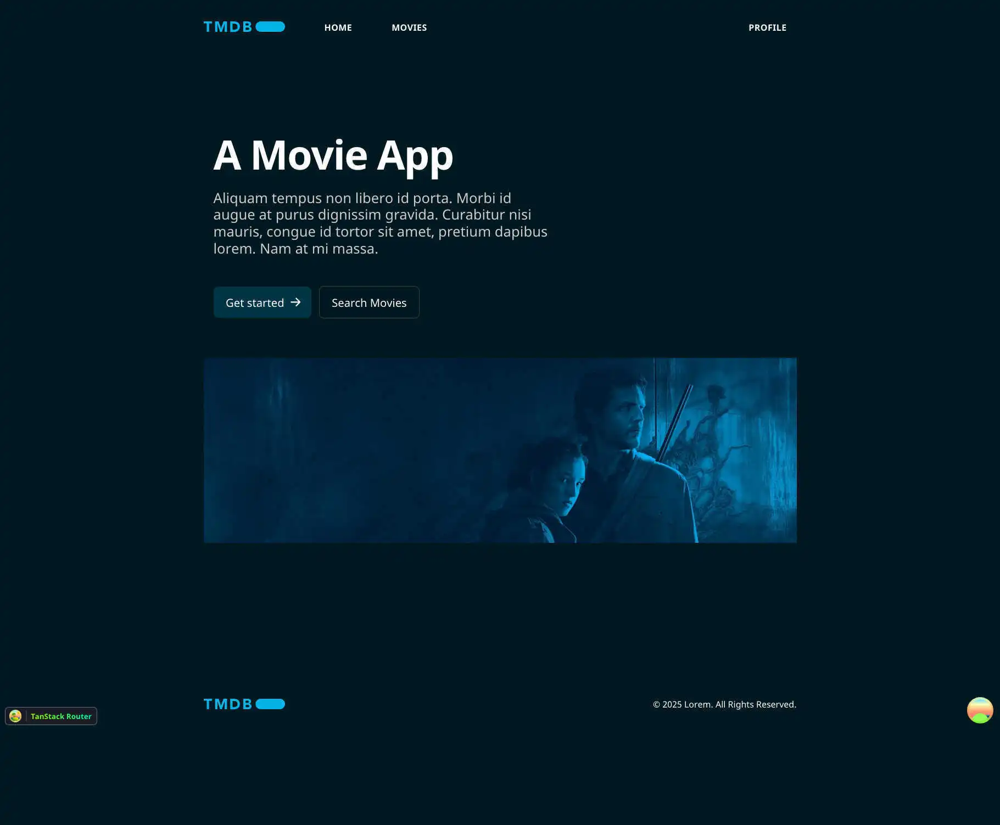

# Sprint 7 IT Academy | Movies consume APIs

## Description

Sprint 7. This is an exercise. It involves consuming data from APIs. It also involves using an authentication service by Supabase.



### Some decisions

- Use Vite and Vitest as development tools.
- Start using TypeScript from the beginning.
- Include TanStack Router and TanStack Query.
- Use Supabase authentication service.

### API keys from

In order to use the Supabase Auth functionality, you will require an API key [Supabase](https://supabase.com/)
In order to watch the films, you will require an API key [TMDB API](https://www.themoviedb.org/)

## Technologies

- React.
- Typescript.
- Vite.
- Vitest.
- Axios.
- TanStack Query.
- TanStack Router.
- Taildwind.

## Requirements

- Node.js v23.9.0
- npm v11.2.0

## Documentation

### Installation

1. Clone this repo

```bash
$ git clone  https://github.com/antoniofelices/movies .
```

2. Install packages

```bash
$ npm install
```

3. Run develop

```bash
$ npm run dev
```

## Future Improvements

- Add tests.
- Create a profile table in Supabase to save custom user data.
- Move the errors to a separate log file.
- Random movie frontpage.

## Contributing

### Code of Conduct

Studio Moare has adopted the Contributor Covenant Code of Conduct that we expect project participants to adhere to. [Please read the full text](https://www.contributor-covenant.org/version/2/1/code_of_conduct/code_of_conduct.md) so that you can understand what actions will and will not be tolerated.
